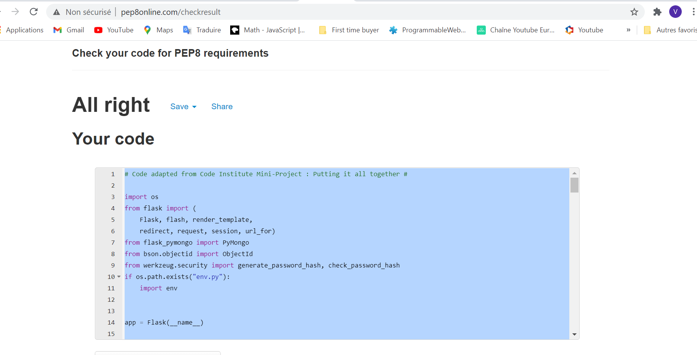

# __Sustainable__

Sustainable is a website aiming to serve as a database for sustainable clothes brands.

In this website, user can share & discover sustainable brands to buy clothes that are
respectful to the environment as well as to other human beings.

In this website, users can complet' the current catalogue by creating new brands, updating
the brands they previously added and, if needed, delete these brands. 

Only registered users access to the create/edit/delete functionalities in order to 
protect the website & the database from random users deleting/editing the work of others.

## **UX**

This website is my third MileStone project for my Fullstack Software Develpment diploma.

The aim of this website was to create a website implementing CRUD operations (Create, Read, Update, Delete).

In my personal life, I already noticed how hard it was to find sustainables clothes brands
that you can trust to buy clothes without hurting others or the planet. That's why I decided
that a database gathering information freely accessible for everyone could be valuable.

**_External users goals_**

*As a user, I want to:*
1. Easily understand the purpose & goals of the website and database
2. Easily navigate through the website
3. Easily follow BoliviAround’s social networks if I am interested
4. Access the current sustainable brands catalogue 
5. Get a synthetic overview of each brand, including their location, name, website &
quick description.
6. For new users: be able to edit the current catalogue by registering
7. For registered users : 
    - be able to log in to access my own part of the catalogue
    - Add new brands, and/or
    - Edit the brands the user previously added, and/or
    - Delete the brands the user previously added,
    - Access the current catalogue, including the brands the user added and/or updated

**_Internal user goal_**

*As a site owner, I want to :*
1. Share my knowledge regarding sustainable brands to allow everyone, easily, to 
make decisions that would be beneficial to the world;
2. Learn from other users' knowledge & gather many useful information to guide customers
in their choices;
3. Give visibility to brands that decide to bet against fast fashion to create a better world;
4. Permit the catalogue to be an open and living catalogue while allowing every users to update,
delete or add their part of the catalogue;
5. Protect the website against vandalism & random users deleting/updating the current catalogue
in a destructive perspective by allowing only registered users to edit/delete the brands they previously added.

**_User experiences_**

*As a customer, I want to navigate easily throught Sustainable:*

A navigation on the top right of the screen synthesis the main sections of the website : About, Sustainable brands, Log in or Register.

After registering for new users, or loging in for current users, the user access to new sections of the website : Manage catalogue which 
is divided inside the navbar into 2 dropdown options : Edit your references or Add a new brand.

Clicking on the title of the website "Sustainable" will bring back the user to the About page.

*As a customer, I want to easily follow Sustainable's social networks if I am interested*

The customer can click into one of the social network icons inside the footer of each pages. Clicking on one of the icon will load another page in the customer browser leading directly to each social network concerned.

*As a customer, I want to be able to understand quickly the goals of the web*

In the About page, I can quickly understand the aim of the website by reading the 3 pillars of the website:
- What the creator of the website believes in
- What the website does
- What the user can do as a part of the community

*As a customer, I want to be access the current sustainable brands catalogue*

Any user, registered or not, can access the current catalogue by clicking on the option
"Sustainables brands" in the navbar or by clicking on the button at the bottom of the About page
"Sustainable brands catalogue".

In this page, current catalogue including sustainable brands added by all users are displayed.

*As a customer, I want to get a synthetic overview of each brand, including their location, name, website &
quick description*

In the Sustainable brands page, all brands are displayed and each of them is quickly described by providing their:
- __name of the brand__
- __location__
- __website__ : clicking on it would open a new page directing the user to the brand's website
- __category__ : is this brand for men/women or for both? While most of them are for both sexes, 
it can be handy to get this information.
- __description__ : the user adding the brand has to describe the brand in a few sentences explaining
why he loves it & what the brand offers.

When each brand is added by a user, these 5 catagories are required in order for the brand to be added to the catalogue.

*As a new user, I want to be able to edit the current catalogue by registering*

New users can register by going to the Register page and creating an account providing a username and a password.

This page is accessible by the button "Register" in the navbar" or by clicking on the button at the bottom of the About page
inside the "What you do" paragraph.

Registering offers the ability for the user to add brands/edit or delete the brands he currently added.

His part of the catalogue would therefore immediatly be displayed inside the Sustainable brands catalogue.

*As a registered users, I want to be able to log in to access my own part of the catalogue*

Registered users can log in by going to the Log in page and providing their username and password.

This page is accessible by the button "Log In" in the navbar".

Afte registering, the "Manage catalogue" page is displayed where the user can access his  
own part of the catalogue, add new brands and/or delete/edit the one he previously added.

*As a registered user, I want to be able to :*

1) *Add new brands, and/or:*

    After registering, the "Manage catalogue" section appears for the users in the navbar &
    the page is displayed to them. 
        
    Register users can then add a brand by clicking on the "Add a brand" button displayed inside
    the "Manage catalogue" page or by clicking on the dropdown "Manage catalogue" button of the navbar
    and chosing "Add a brand".
        
    The Add page is therefore displayed where the user has to provide relevant information regarding the brand
    (location, name, website, description, category). Every information is required as it provides useful information
    to users.

    By clicking on "Confirm", the brand is created & displayed inside the current shared catalogue "Sustainable brands"
    and inside his own current part of the catalogue. 
    A pop up message appears to confirm that the brand was added & the "Manage catalogue" page is displayed.

2) *Edit the brands the user previously added, and/or*
    
    After registering, the "Manage catalogue" section appears for the users in the navbar &
    the page is displayed to them. 
        
    Register users can then edit a brand by clicking on the "Edit" button displayed inside
    the "Manage catalogue" page for every brands previously added, or by clicking on the dropdown "Manage catalogue" button of the navbar
    and chosing "Edit your references".
        
    The Edit page is therefore displayed where the user can edit the previous information regarding the brand
    (location, name, website, description, category).
        
    By clicking on "Confirm", the brand is updated & the update is displayed inside the current shared catalogue "Sustainable brands"
    and inside his own current part of the catalogue.
    A pop up message appears to confirm the update to the user & the "Manage catalogue" page is displayed.

3) *Delete the brands the user previously added:*

    After registering, the "Manage catalogue" section appears for the users in the navbar &
    the page is displayed to them. 
        
    Register users can then delete a brand by clicking on the "Delete" button displayed inside
    the "Manage catalogue" page for every brands previously added, or by clicking on the dropdown "Manage catalogue" button of the navbar
    and chosing "Edit your references".
        
    By clicking on "Confirm", the brand is deleted & the update is displayed inside the current shared catalogue "Sustainable brands"
    and inside his own current part of the catalogue.
        
    A pop up message appears to confirm the deletion to the user & the "Manage catalogue" page is displayed.

4) *Access the current catalogue, including the brands the user added and/or updated*

    As a registered user, I can access :
    - my own part of the catalogue with the brands I added, by clicking on the dropdwn button 
    of the navbar "Manage catalogue" and then "Edit your references" 
    - the current shared catalogue by clicking on the "Sustainable brands" button of the navbar
    All updates are immediatly displayed inside both catalogues.

*As a registered user, I want to be able to log out from my session when my contribution is over*

As a registered user, the navbar offers the option to « Log out » from the session.
After loging out, a message is displayed to confirm the logging out to the user.
Then, the user is redirected to the log in page.

*I especially tested twice the following features to be sure they work properly :*

* _Responsive versions of the website :_
Phone: Moto G4, Galaxy S5, Pixel 2, Pixel 2 XL, Iphone 5/SE, Iphone 6/7/8, Iphone 6/7/8 Plus, Iphone X

    Tablet: Ipad, Ipad Pro, Surface Duo

* _Browsers_ : 
    Website tested throught Microsoft Edge and Chrome browsers

* _Links_:
    Logo text in navigation bar to be sure it brings the customer back to Sustainable website (i.e. about.html)
    About, Sustainable brands, Register, Log In, Manage catalogue (Add a brand & Edit your references) 
    in navigation bar to make sure links work properly and brings to the correct sections of the page
    Social Media icons in Footer to be sure they were correct links and open in another page
    Buttons in all pages to ensure they were displaying the correct pages

* _CRUD functionalities_:
    Add/read/edit/delete functionalities & ask a few friends to test the functionalities on their side 
    to ensure its works & immediatly displayed inside the catalogue.

## **Design**

I am really interested regarding design, and paid a special attention to this website
design. My goal was to make it simple, minimalist and interactive - in order to put
the user in the heart of the website.

**_Colour schemes_**

In this way I decided to choose a simple contrast between black and white colors,
enhanced by colors added to edit/add buttons (as these buttons are the key to add
value to the current catalogue).

**_Typography_**

Regarding the typography, I decided to use 2 Google fonts :
- __Indie Flower__ : because of his young, and natural effect, as it reproduces human 
writing;
- __Lato__ : to contrast with the round effect given by Indie Flower & give more substance
to the paragraph with a more classic typography.

**_Icons_**
I decided to use Fontawesome in order to provide illustrations in my website 
as it offers a wide catalogue of icons.

## **Frameworks**

1. __[Flask](https://flask.palletsprojects.com/en/1.1.x/)__ : A framework written in Python that gives a lot of flexibility to the coding
2. __[Bootstrap](https://getbootstrap.com/)__ : I decided to stick to bootstrap as I find some of the functionalities
really easy & handy to use and like his overall design & flexibility.
2. __[JQuery](https://jquery.com/)__ : I used some JQuery codes to enhance the interacte effect of the website
by making div slide in while the user discovers the website. The code I used where
definetely adapted from the current source : [TO ADD]

## **Wireframes** 

I used Balsamic to build my wireframe prior to the website coding.

The idea was to get an idea of what sections I would build and what design 
I would roughly create. Wireframes were built regarding desktop, tablet and phone 
versions: 

* [Balsamic Wireframes (desktop, tablet, phone)](/workspace/Sustainable/documentation/wireframes/ms3_wireframes.pdf)

From the idea to the realization, a lot of changes have been performed - especially
regarding the add of register/log in functionalities as I realized later on the project that 
it would be necessary to protect to the database against vandalism.

## __Features__

1. __Existing Features__

*__Navigation__* : 
* I use the simple and clear navigation code suggests in __[Bootstrap](https://getbootstrap.com/)__. 
All sections are presented to ease the user experience and direct to relevant links when clicked.

*__Modals__*
* I use the modal code suggests in __[Bootstrap](https://getbootstrap.com/)__. 

*__Main content__* : 
* I used __[Javascript](https://www.javascript.com/)__ to :
    - make sections of the website slide in to add some interactive effect to the navigation (About & Sustainable brands pages)
    - make pop up modals appear when an action has been performed by the user, to deliver feedbacks 
    (After adding, deleting, updating a brand, or registering/loging in)

*__Form__* : 

* I use a simple form template provided by __[Bootstrap](https://getbootstrap.com/)__ in the Contact us section.`

*__CRUD__*

After creating a relevant collection inside __[MongoDB](https://www.mongodb.com/)__ to gather the database informations, 
I used Python & flask to create a plateform allowing users to create, read, update & delete
relevant data in order to create a useful shared catalogue.
This code was largely inspired & adapted from the Mini project described in Code institute
classes.
* __Create__: The user can add a brand to the database base & view it inside the catalogue.
* __Read__: Users can access the current catalogue gathering all users' additions.
* __Update__: Registered users can update the brands they previously created.
* __Delete__: Registered users can delete the brands they previously created.

2. __Features left to implement__

*__Favorite sections__* : I would like to add a favorite section where users can add
his/her favorite brands.
*__Help to the user who losts his password__* : I would like to add a functionality with
a button "Forgot your password?" where the user could click to get his password
sent back by email or by sending him/her a link to modify his/her password.

## __Technologies used__

* __HTML__:
The project uses HTML to create the content of the website and his structure. 
* __CSS__: 
The project uses CSS for the design of the website 
* __[Javascript](https://www.javascript.com/)__:
The project uses Javascript to add interactivity with the user.
* __[JQuery](https://jquery.com/)__:
The project uses JQuery to manipulate the DOM.
* __[Bootstrap](https://getbootstrap.com/)__:
The project uses Bootstrap in the overall design. Grid, navbar, form, modal and many other features described in the Features' section were coded from Bootstrap interface.
* __[Fontawesome](https://fontawesome.com/)__:
The project uses Fontawesome 
    - in the footer to refer to 2 social networks (Youtube, Instagram) & phone/address information
    - in the titles of pages to add an illustration of the pages' purpose that is visually appealing to the users 
    - in register/log in pages to illustrate the data "username" & "password"
    - in the search bar 
* __[Googlefonts](https://fonts.google.com/)__:
The project uses GoogleFonts to choose the two fonts family used for the design of this website (Lato and Indie Flower)

* __[Heroku](https://www.heroku.com)__: Host of my full stack website.

* __[Python](https://www.python.org/)__:

    - __Python__ - My main Back-End programming language.

    - __PyMongo__ - Python's API for MongoDB integration.

* **Flask**

    - __[Flask](https://flask.palletsprojects.com/en/1.1.x/)__ - Open-source micro framework for web development in Python

    - __[Click](https://click.palletsprojects.com/en/7.x/)__ - A Python package to create command line interfaces.

    - __[DNSpython](https://www.dnspython.org/)__ - Domain Name system toolkit used by Python

    - __[Jinja](https://jinja.palletsprojects.com/en/2.11.x/)__ - Useful to template in relation with Flask

    - __[itsdangerous](https://itsdangerous.palletsprojects.com/en/1.1.x/)__ - Permits to cryptographically sign data

    - __[Werkzeug](https://werkzeug.palletsprojects.com/en/1.0.x/)__ - A CGI Library for Flask

* __[MongoDB](https://www.mongodb.com/)__: Storage of my database.

## __Tools used__

* [Bootstrap](https://getbootstrap.com/)
* [W3C HTML Validator](https://validator.w3.org/)
* [W3C CSS Validator](https://jigsaw.w3.org/css-validator/)
* [PEP8 Validator](http://pep8online.com/)
* [Chrome DevTools](https://developer.chrome.com/docs/devtools/open/)

## __Testing__

### 1. __Testing tools used__

*__W3C HTML Validator__* - I run my url website through the validator &
no errors were identified:

*__W3C CSS Validator__*

* I run my style.css code through the validator &
no errors were identified:

*__PEP8 validator__* : 

* I run my app.py Python's code through the validator &
no errors were identified:

*__Chrome DevTools__* : 

* No problems identified regarding design & responsiveness for the following devices:
    * **Phone**: Moto G4, Galaxy S5, Pixel 2, Pixel 2 XL, Iphone 5/SE, Iphone 6/7/8, Iphone 6/7/8 Plus, Iphone X
    * **Tablet**: Ipad, Ipad Pro, Surface Duo

### 2. __Test UX__

Details of the full test performed (with screenshots) on this project can be found [here](/workspace/Sustainable/documentation/tests/tests_ux.pdf).

## __Deployment__

Because of their clarity & transparence,
I widely adapted this section from the README of 
Juan Stelling [project](https://github.com/juanstelling/MS3_breaktasty).

__Tools used to deploy__

* __[Github](https://github.com/)__
* __[Heroku](https://www.heroku.com)__
* __[Python3](https://www.python.org/downloads/)__
* __[MongoDB](https://www.mongodb.com/)__

__Clone the project__

To make a local clone:

* Log in to GitHub and go to the repository.
* Click on the “Code” button.

__Working with a local copy__

__1.__ In the workspace of the local copy, type in the terminal window: __pip3 install -r requirements.txt__.

__2.__ Create a database in MongoDB
* Login to the MongoDB account.
* Create a cluster and a database.
* Create collections inside the database: brands, categories, users.
* Add following values to the three collections:
    - For __brands collection__:
        
        __1)__ _id: ObjectId
        
        __2)__ country : string
        
        __3)__ brand_name : string
        
        __4)__ category_name: string
        
        __5)__ description: string
        
        __6)__ website: string
        
        __7)__ created_by: string

    - For __categories collection__:

        __1)__ _id: ObjectId
    
        __2)__ category_name: string
    
    - For __users collection__:
        __1)__ _id: ObjectId

        __2)__ username: string
        
        __3)__ password: string

* Create the environment variables

* Create a __.gitignore__ file in the root directory of the project.

* Add the __env.py__ file in the .gitignore.

* Create the file __env.py__ to contain environment variables.

__Import os:__
> os.environ.setdefault("IP", "To be added by developer")
os.environ.setdefault("PORT", "To be added by developer")
os.environ.setdefault("SECRET_KEY", "To be added by developer")
os.environ.setdefault("MONGO_URI", "To be added by developer")
> os.environ.setdefault("MONGO_DBNAME", "To be added by developer")

__3.__ Type __python3 app.py__ to run the app

__Heroku Deployment__

1. Set up local workspace for Heroku

    - In terminal window type: __pip3 freeze -- local > requirements.txt.__ 
    - In termial window type: __python app.py > Procfile__

2. Set up Heroku: create a Heroku account & a new app 

3. Deployment on Github

    * Connect to GitHub in the deploy section in Heroku: Search the repository to connect with. (Click on connect)
    * Go to the settings in Heroku & to Config Vars > Reveal Config Vars:
    Enter your env.py variables: 
    
    __IP, PORT, SECRET_KEY, MONGO_URI, MONGO_DBNAME__

4. Push the requirements.txt and Procfile to repository
>$ git add requirements.txt
>$ git commit -m "Add requirements.txt"
>$ git add Procfile 
>$ git commit -m "Add Procfile"

5. Go to the deploy tab in Heroku and scroll down to Automatic deployments. 
Click on Enable Automatic Deploys. By Manual deploy click on Deploy Branch.

The app opens. The live link is available from the top button on the right.

## __Credits__

__Content__: 

Texts were written by myself to fit with this website's goals.

Nonetheless brands' description inside the catalogue were mainly
inspired from an article of [Wedressfair](https://www.wedressfair.fr/blog/29-marques-ethiques-pour-un-dressing-responsable)

__Images__:

All images used in this website come from [Pixabay](https://pixabay.com/fr/)

__README.md__:

Because of their clarity & transparence,
I widely adapted this section from the README of 
Juan Stelling [project](https://github.com/juanstelling/MS3_breaktasty).

__Acknowledgements:__

Eventually I received help for my code by reading answers from questions on the websites:

* [W3schools.com](https://www.w3schools.com/)

* [Stack Overflow](https://stackoverflow.com/) - especially : 
    - to customize the dropdown button in the navbar ([here](https://stackoverflow.com/questions/49204071/how-to-change-navbar-dropdown-click-color-bootstrap-using-bootswatch-theme))

* [To The New blog](https://www.tothenew.com/):
    - to make div/sections slide down inside the screen ([here](https://www.tothenew.com/blog/slide-in-animation-while-scrolling-page/))

* [Code Institute](https://codeinstitute.net/) - especially :
    - the Python code used to implement CRUD operations from the Mini Project (Data centric development module)
    - the Hero image code adapted from the Mini Project - Love running (CSS Fundamentals module)